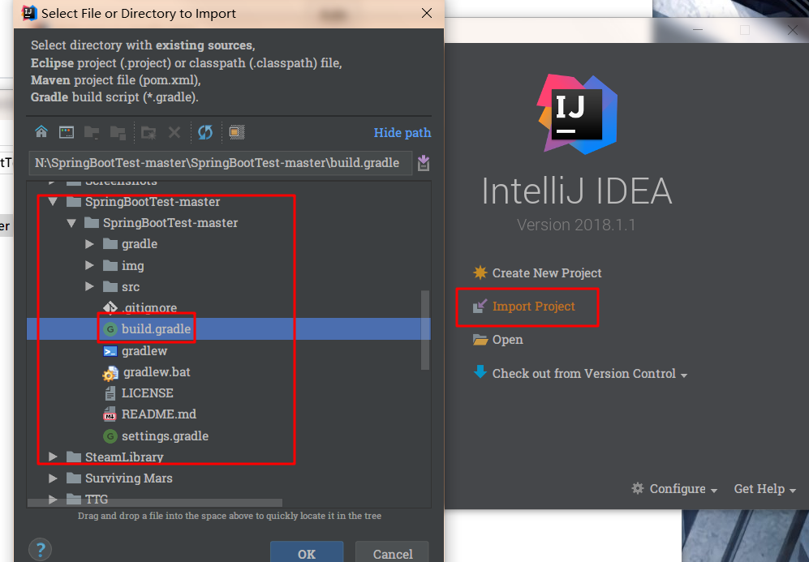
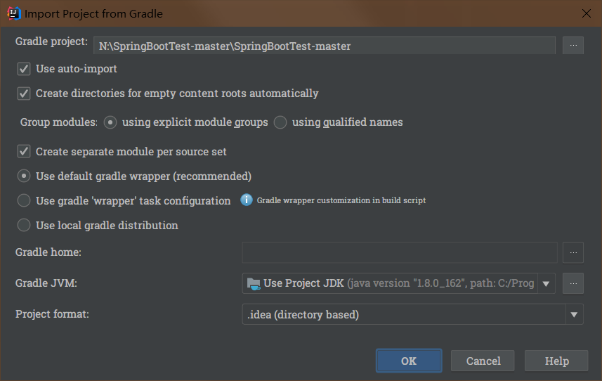
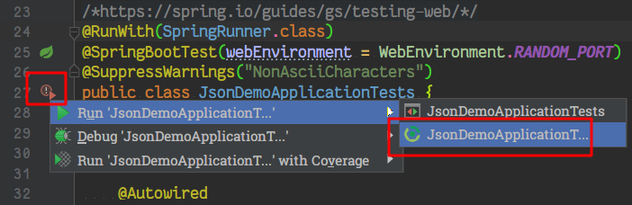
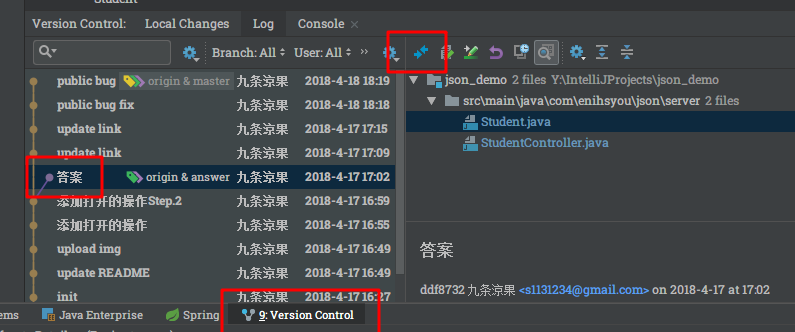

# 你需要做什么

1. 使用IntelliJ IDEA或者Android Studio打开项目

如果你是Android Studio

1. 去 [`Student`](src/main/java/com/enihsyou/json/server/Student.java#L9-L37) 类中，添加Getter Setter等JavaBean的方法

2. 去 [`StudentController`](src/main/java/com/enihsyou/json/server/StudentController.java#L15-L116) 类中，
完成 [`listStudentsUsingGson`](src/main/java/com/enihsyou/json/server/StudentController.java#L31-L40)
和 [`createStudentsUsingGson`](src/main/java/com/enihsyou/json/server/StudentController.java#L42-L55) 这两个方法

3. 运行 [`JsonDemoApplicationTests`](src/test/java/com/enihsyou/json/server/JsonDemoApplicationTests.java#L23-L139) 进行测试。
IntelliJ IDEA的操作步骤如下，Android Studio的只需要点Run就行。

如果你是Android Studio，启动服务器请使用右侧边栏的Gradle里的 `Tasks > application > bootRun`

遇到提示
> Warning: Working directory '...../.idea/modules' doesn't exist

请把 `Run/Debug Configurations`里的`Working directory`改成`%MODULE_WORKING_DIR%`
（善用`Ctrl+Shift+A` (`⌘+⇧+A`) 搜索功能）

4. [`test.http`](src/main/java/com/enihsyou/json/server/test.http) 是个请求的模拟发送器

期望同学们能得到:white_check_mark:All Green的正确结果:smiley:

~~参考答案请切换到 *answer* 分支~~

